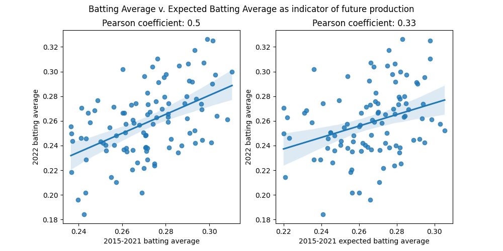
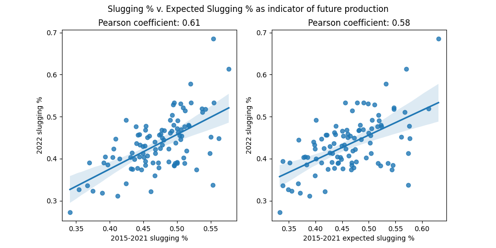
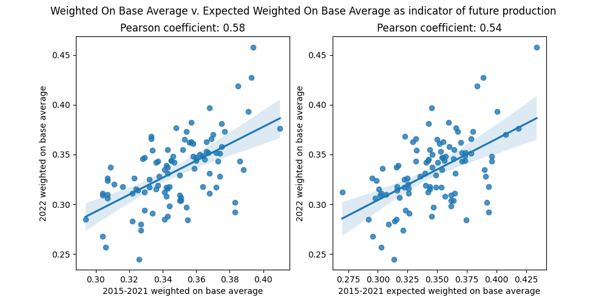

# What is more predictive of future performance: Traditional Stats or Expected Stats?

## History

For many years, baseball fans and statisticians only had routine counting stats and those based off of dividing events by opportunities ( # of hits / # of at bats for batting average). But in 2015, with the introduction of Statcast, we now had a new way of quantifying a player's skill. Instead of gauging how often a player gets a hit, we started evaluating how often a player *should* be getting a hit. 

## Expected Stats

Expected stats are determined by examining batted ball data (launch angle of contact, exit velocity of ball off the bat, etc) and determining what that event normally produces in the form of a percentage. For example, if a batted ball has exit velocity of 100 mph and a launch angle of 25 degrees, it produces the following outcomes per Baseball Savant:
BA: .605 1B%: 1.8 2B%: 25.9 3B%: 4.9 HR %: 28.0

## Adoption

Expected stats were anticipated to help teams determine a player's true performance and value. Sure, a player may be hitting .200, but maybe he is just unlucky? If his batted ball metrics are strong, and he actually has a high Expected Batting Average, then he will definitely play better in the future.  
People have started to look to these stats to predict how a player will perform in the future, but are these stats actually more indicative of a player's future performance than traditional stats.

## Study

I decided to create an interactive tool, found here, that is capable of of fetching data from 2015 until now, and calculating whether expected stats or traditional stats are more valuable in predicting a player's future performance. The stats used are Batting Average, Slugging Percentage, Weighted On Base Average, and their expected equivalents.

### How it works 

You run this tool by supplying two arguments: **sample_seasons**, which can be one or more seasons used as a baseline in averaging out a player's performance over this time period, and **test_season**, which is a single season you want to compare the averaged result of **sample_seasons** to. From there, the Pearson Coefficient between the **sample_seasons** and **test_season** is calculated, where the higher the value, the stronger the correlation. The results are output in graphical form, with 3 windows and 2 graphs per window, where each graph compares one sample season and statistic to its corresponding test season and statistic.

### Caveats

To be included in the study, a player needed to have at least 502 at bats over the sample season(s) period and 1 at bat over the test season period. 502 at bats qualifies you for a batting title, hence why it was used.  
Additionally, it is important to note that Baseball Savant does not average out expected stats when you request multiple seasons at a time. So, I went through each season, fetched the expected stat, calucated what percentage of total at bats that season was responsible for, and added ( the stat value x's percentage of total at bats) to a summed stat to find the true average of the expected stat over a period of time. So, if a player had a .300 xBA in 10 at bats in 2019, and a .200 xBA in 20 at bats in 2018, his xBA over that two year period = (.300 * (15/30) + .200 * (15/30) = (.150) + (.100) = .250.  
Lastly, Baseball Savant's API is not returning data for 2020, which may be because 0 players qualified for a batting title that year due to the COVID-shortened season. So, all calculations do not include that year.

### Using the tool

```
python3 expected_comp.py --help
usage: expected_comp.py [-h] --sample_seasons SAMPLE_SEASONS --test_season TEST_SEASON

A utility that pulls, graphs, and compares historical traditional and expected stats in order to determine which is a better indicator of future performance
r^2 will be used to judge which stat has a strong, linear correlation to future production

options:
  -h, --help            show this help message and exit
  --sample_seasons SAMPLE_SEASONS
                        The season(s) you want to use as a baseline
  --test_season TEST_SEASON
                        The future season you want to use to see if traditional stats or expected stats are a better predictor of
```
#### Good examples
```
python3 expected_comp.py --sample_seasons 2015-2021 --test_season 2022
```
```
python3 expected_comp.py --sample_seasons 2021 --test_season 2022
```
#### Bad examples

```
python3 expected_comp.py --sample_seasons 2015-2021 --test_season 2024
ERROR: Cannot fetch Statcast data for 2024. Has data been published for this year yet?
```
```
python3 expected_comp.py --sample_seasons 2014 --test_season 2023
ERROR: Statcast data was introduced in 2015, you cannot search for data before this point
```
```
python3 expected_comp.py --sample_seasons 20149e42 --test_season 2023
usage: expected_comp.py [-h] --sample_seasons SAMPLE_SEASONS --test_season TEST_SEASON
expected_comp.py: error: argument --sample_seasons: You must either supply a single season, or multiple, consecutive seasons separated by a hyphen.
Ex. 2001-2004
```

## Results

### Graphs

Here are the graphed results, along with their corresponding Pearson Coefficient's, when comparing a player's 2015-2021 expected and traditional stat performance to their traditional stat performance in 2022:
  

According to the graph, neither BA nor xBA is strongly correlated to future BA performance. However, we can see here that traditional BA has a stronger correlation to future BA performance.


  

According to the graph, neither SLG nor xSLG is strongly correlated to future SLG % performance. However, we can see here that traditional SLG % has a stronger correlation to future SLG % performance.


  

According to the graph, neither wOBA nor xwOBA is strongly correlated to future wOBA performance. However, we can see here that traditional wOBA has a stronger correlation to future wOBA performance.

### Conclusions

A couple conclusions can be drawn from interpreting these results, which include the total of all complete seasons that have used Statcast data:

* Neither traditional nor expected stats, when viewed in isolation, are great indicators of a player's future performance. These stats cannot be solely relied upon to draw conclusions. It would be better to shrink your scope, and see how well a single player or class of player's stats are correlated to the future, in addition to considering more than just the stats here.

* Expected stats are not more helpful than traditional stats. Though neither stat is strongly correlated to future performance, expected stats, which were thought to usurp traditional stats as more valuable in interpreting a player's performance, is actually *less* helpful than traditional stats in predicting a player's future performance. 
